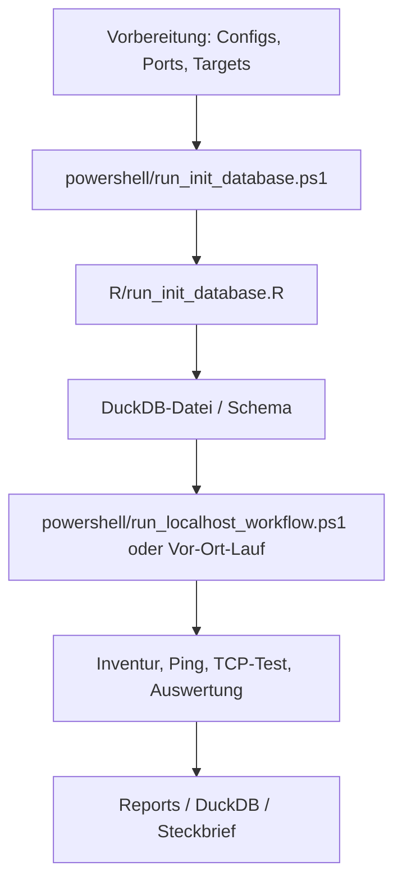

---
title: "README"
output: "html_document"
---

# NetzwerkAnalyse

Lokales Git-Repository fuer eine Analyse- und Monitoring-Infrastruktur rund um OT-Netze, Anlagen und Maschinen.

## Oeffentliche Kurzfassung

Dieses Repository sammelt Werkzeuge, Doku und Auswertungen fuer lokale
Netzwerk-Inventuren, konfigurierbare TCP-Port-Messungen auf einem oder
mehreren Ports pro Zielhost und Vergleiche zwischen direkter Verbindung und
Switch.

Die Repo-Contents sind bewusst so aufgebaut, dass Rohdaten, Scans und andere
laufende Messartefakte lokal unter `data/` oder `reports/` landen. Die
kuratierten Markdown-Dokumente im Repo bleiben versioniert, damit die Doku
nachvollziehbar bleibt.

## Einstieg

Bevor du am Projekt arbeitest, lies bitte:

1. [AGENTS.md](AGENTS.md)
2. [SECURITY.md](SECURITY.md)
3. [Statusanker.md](Statusanker.md)
4. die Checkliste in [docs/07_vor_ort_checkliste_scan_auswerte_workflow.md](docs/07_vor_ort_checkliste_scan_auswerte_workflow.md)
5. das Betriebsmanual in [docs/06_betriebsmanual_workflow.md](docs/06_betriebsmanual_workflow.md)
6. die Konfigurationsreferenz in [docs/08_konfigurationsreferenz.md](docs/08_konfigurationsreferenz.md)
7. den Konfigurations-Spickzettel in [docs/09_konfigurations_spickzettel.md](docs/09_konfigurations_spickzettel.md)
8. das DuckDB-Datenmodell in [docs/11_duckdb_datenmodell.md](docs/11_duckdb_datenmodell.md)

## Zielbild

- Netzwerke und Assets inventarisieren
- Anlagen und Maschinen scannen und pruefen
- Monitoring und Performance-Analysen aufbauen
- Netzwerkzugriffe und Auffaelligkeiten auswerten
- Ergebnisse reproduzierbar dokumentieren

## Bevorzugte Werkzeuge

1. R
2. Python
3. PowerShell

## Erste Struktur

- `R/` fuer Auswertungen, Reports und Visualisierungen
- `python/` fuer Automatisierung, Parser und Analyse-Skripte
- `powershell/` fuer Windows-nahe Orchestrierung und Datensammlung
- `sql/` fuer wiederverwendbare Abfragen
- `templates/` fuer Vorlagen und wiederverwendbare Markdown-Strukturen
- `data/raw/` fuer Rohdaten, Exporte und Scans
- `data/processed/` fuer bereinigte oder aggregierte Daten
- `docs/` fuer Konzepte, Doku und Entscheidungen
- `configs/` fuer Konfigurationen und Workflows
- `reports/` fuer erzeugte Berichte
- `AGENTS.md` fuer agentenbezogene Arbeitsregeln
- `SECURITY.md` fuer Publikations- und Sicherheitsregeln

## Mogliche Analyse-Bausteine

- `inventory` fuer Asset-Erfassung
- `scan` fuer Nmap-Workflows
- `traffic` fuer Wireshark- oder PCAP-Auswertung
- `alerts` fuer Auffaelligkeiten und Checks

## Inventur und Auswertung

- lokale Inventur mit `arp`, `netstat` und Schnittstellen-Informationen
- Steckbrief als Markdown aus R
- optional DuckDB als lokale Auswertungsbasis
- spaeterer Vergleich mehrerer Anlagen und Messlaeufe

## Ablauf auf einen Blick

Der genaue Vor-Ort-Ablauf steht im [Betriebsmanual](docs/06_betriebsmanual_workflow.md).

## Konfigurations-Spickzettel

| Datei | Zweck | Typische Schluessel |
| --- | --- | --- |
| `configs/targets.csv` | generische Zielvorlage | `label`, `host`, `port`, `request` |
| `configs/targets.private.csv` | lokale, ignorierte Zielkonfiguration | `label`, `host`, `port`, `request` |
| `configs/targets.production.example.csv` | Vorlage fuer reale Anlagenziele | `label`, `host`, `port`, `request` |
| `configs/run.direct.csv` | Direktlauf | `ping_count`, `tcp_count`, `tcp_port`, `session_tag`, `output_dir` |
| `configs/run.switch.csv` | Switchlauf | `ping_count`, `tcp_count`, `tcp_port`, `session_tag`, `output_dir` |
| `configs/run.localhost.csv` | Trockenlauf | `ping_count`, `tcp_count`, `tcp_port`, `session_tag`, `output_dir` |
| `configs/scan_targets.csv` | Nmap-Ziele | `label`, `host`, `ports` |
| `configs/duckdb_jdbc.example.csv` | optionale JDBC-Anbindung | `jar_path`, `db_path`, `driver_class` |
| `sql/ddl/network_analysis_schema.sql` | DuckDB-DDL fuer die Basisstruktur mit internen Schluesseln und Views | `schema_metadata`, `inventory_sessions`, `benchmark_rows`, `benchmark_summary`, `inventory_overview`, `benchmark_overview`, `benchmark_rows_ping`, `benchmark_rows_tcp` |

## Workflow Werkzeuge

| Script | Zweck | Output | DuckDB |
| --- | --- | --- | --- |
| `powershell/run_init_database.ps1` | Datenbank initialisieren | `data/processed/network_analysis.duckdb` | ja |
| `powershell/inventory_collect.ps1` | lokale Inventur | `data/raw/inventory/<timestamp>/` | optional |
| `powershell/run_inventory_steckbrief.ps1` | Inventur-Steckbrief erzeugen | `reports/steckbrief_*.md` | nein |
| `powershell/run_benchmark.ps1` | TCP-Port-Messungen, Standard ist 9000 | `data/raw/direct/` oder `data/raw/switch/` oder `data/raw/sim/` | ja |
| `powershell/run_benchmark_comparison.ps1` | Direkt-vs-Switch-Vergleich | `reports/network_direct_vs_switch.md` | nein |
| `powershell/archive_data_backup.ps1` | Daten sichern und Arbeitsbestand resetten | `data/backups/YYYYMMdd_HHmmss_Databackup/` | nein |
| `powershell/restore_data_backup.ps1` | Backup wiederherstellen | Rueckspielung von `data/raw/`, `data/processed/`, `reports/` | nein |
| `powershell/run_localhost_workflow.ps1` | lokaler Trockenlauf | `reports/network_overview_localhost.md` und lokale Rohdaten | ja |
| `powershell/run_nmap_scan.ps1` | konservative Nmap-Scans | `data/raw/scans/nmap/` | nein |
| `powershell/list_capture_interfaces.ps1` | `tshark -D` anzeigen | nur Konsole | nein |
| `powershell/start_wireshark_capture.ps1` | paketbasierter Mitschnitt | `data/raw/pcap/*.pcapng` | nein |
| `powershell/start_suricata_capture.ps1` | passives Logging | `data/raw/suricata/` | nein |
| `R/run_init_database.R` | DuckDB-Initialisierung aus R | `data/processed/network_analysis.duckdb` | ja |
| `R/run_inventory_steckbrief.R` | Markdown-Steckbrief | `reports/steckbrief_*.md` | nein |
| `R/run_benchmark.R` | Messlaeufe aus R | Roh-CSV-Dateien pro Lauf | ja |
| `R/run_benchmark_comparison.R` | Direkt-vs-Switch-Vergleich | `reports/network_direct_vs_switch.md` | nein |
| `R/run_multirun_analysis.R` | gemeinsame Analyse mehrerer Sessions | `reports/network_overview.md` und CSV-Aggregate | ja |
| `R/run_duckdb_analysis.R` | laedt die lokalen Daten in DuckDB, erstellt Views und Report | `reports/network_overview_duckdb.md` | ja |
| `R/run_duckdb_query.R` | einzelne SQL-Abfragen | Report oder CSV je nach Ausgabe | ja |
| `R/run_duckdb_overview_report.R` | lesender DuckDB-Analyse-Report aus bestehender DB | `reports/duckdb_analysis_overview.md` | ja |

## Betriebsmanual

- `docs/06_betriebsmanual_workflow.md` fuer die Reihenfolge vor Ort und die
  notwendigen Einstellungen
- `docs/07_vor_ort_checkliste_scan_auswerte_workflow.md` fuer die kompakte
  Vor-Ort-Checkliste
- `docs/08_konfigurationsreferenz.md` fuer die komplette Config-Referenz
- `docs/09_konfigurations_spickzettel.md` fuer den schnellen Vor-Ort-Ueberblick
- `docs/10_nmap_optionen_ot.md` fuer die Nmap-Einordnung in OT-Netzen

## Start In 3 Schritten

1. `powershell/run_init_database.ps1` ausfuehren
2. `powershell/run_localhost_workflow.ps1` fuer den Trockenlauf oder
   `powershell/inventory_collect.ps1` plus `powershell/run_benchmark.ps1` fuer
   den echten Lauf starten
3. die Reports in `reports/` und die DuckDB-Datei in
   `data/processed/network_analysis.duckdb` pruefen

## GitHub Hinweis

- Beispiel-IPs in `configs/*.csv` sind absichtlich Platzhalter
- reale Zieladressen gehoeren in die lokale, ignorierte `configs/targets.private.csv`
- echte Anlagenadressen gehoeren nicht ins Repo
- Rohdaten, Scans und Reports bleiben lokal und werden nicht versioniert
- TCP-Ports sind konfigurierbar; `9000` ist nur der Standardwert und pro Zielhost kann ein eigener Port gesetzt werden

## Public Repo Hinweis

Ein public GitHub-Repository ist fuer alle lesbar, aber nicht fuer alle
beschreibbar.

- Push-Rechte haben nur Besitzer, Admins oder explizit berechtigte
  Collaborators
- andere koennen das Repo forken oder per Pull Request beitragen, wenn du das
  erlaubst
- ohne Schreibrechte kann niemand direkt auf dieses Repo pushen

Wenn du das Repo oeffentlich lassen willst, halte die Beispielkonfigurationen
generisch und pruefe vor jedem Push `SECURITY.md` und `.gitignore`. Laufzeit-
Artefakte sollten lokal bleiben; versioniert werden nur bewusst gepflegte
Dokumente und Vorlagen.

