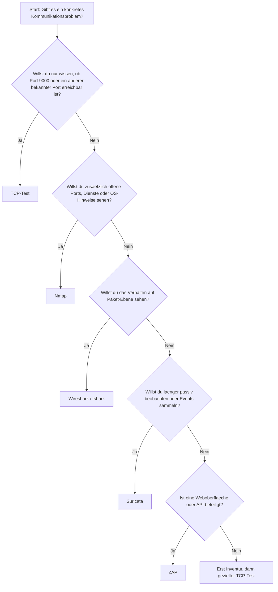

---
title: "02 inventur und werkzeuge"
output: "html_document"
---

# Inventur, Auswertung und Werkzeuge

## Ziel

Am Anfang soll der PC lokal eine erste Netzwerkinventur machen. Die Ergebnisse werden als Rohdaten gespeichert und anschliessend in einen Markdown-Steckbrief ueberfuehrt.

## Was erfasst wird

- `arp` bzw. Neighbor-Tabelle
- `netstat` bzw. TCP-Verbindungen und Listeners
- Netzwerkschnittstellen
- IP-Konfiguration
- Host- und OS-Informationen

## Warum das hilfreich ist

Damit bekommst du einen schnellen Ist-Zustand:

- Welche Adapter sind aktiv?
- Welche Nachbarn sind sichtbar?
- Welche Prozesse halten welche Verbindungen?
- Gibt es unerwartete offene Ports?

## DuckDB als Auswertungsschicht

Ja, DuckDB ist dafuer sehr gut geeignet.

### Vorteile

- lokale Datei statt Serverbetrieb
- sehr gut fuer CSV- und Parquet-Auswertung
- einfach fuer spaetere Benchmarks und Zeitvergleiche
- mehrere Anlagen, mehrere Sessions, ein gemeinsames Schema

### Sinnvolle Nutzung

Rohdaten bleiben als CSVs erhalten.
DuckDB wird dann fuer Auswertungen benutzt, zum Beispiel:

- Inventuren pro Anlage
- Zeitreihen von Ping- und TCP-Messungen
- Vergleich zwischen direkter Verbindung und Switch
- Vergleich verschiedener Geraete oder Anlagen

### Praktische Empfehlung

Wir bauen es so auf:

1. Rohdaten als CSV sammeln
2. R schreibt daraus einen Steckbrief als Markdown
3. optional: Daten in DuckDB laden
4. spaeter Benchmarks und Vergleiche in R oder SQL auswerten

### Zwei moegliche R-Wege

- Nativer DuckDB-R-Client ueber das `duckdb`-Paket
- JDBC ueber `RJDBC`, `rJava` und das JAR `duckdb_jdbc-1.5.5.0.jar`

Wenn du bereits das JDBC-JAR heruntergeladen hast, koennen wir den JDBC-Weg direkt nutzen.
Der Standard-Flow fuer das Projekt bleibt trotzdem: CSV sammeln, Markdown erzeugen, dann optional in DuckDB laden.

### Einfache Startskripte

- `R/run_inventory_steckbrief.R` fuer den automatischen Inventur-Steckbrief
- `powershell/run_inventory_steckbrief.ps1` fuer den Start aus PowerShell
- `R/run_benchmark.R --run=configs/run.direct.example.csv --targets=configs/targets.csv`
  fuer einen Direktlauf
- `R/run_benchmark_comparison.R` fuer den Direkt-vs-Switch-Vergleich

## Wie du Wireshark, Nmap, ZAP und Suricata sinnvoll nutzt

| Werkzeug | Worum geht es? | Wann ist es am sinnvollsten? | Wofuer eher nicht? |
| --- | --- | --- | --- |
| TCP-Test | gezielte Erreichbarkeits- und Laufzeitpruefung auf einem bekannten Port | wenn du wissen willst, ob Port 9000 oder ein anderer freigegebener Port wirklich erreicht wird | fuer Portsuche oder Protokoll-Fingerprinting |
| Nmap | strukturierte Host-, Port- und Dienstsicht | wenn du vor oder nach dem TCP-Test sehen willst, welche Dienste offen sind und ob es Zusatzhinweise gibt | fuer exakte Latenz- oder Belastungsmessung |
| Wireshark / tshark | Paket- und Protokollanalyse auf Frame-Ebene | wenn du Retransmits, ACK-Muster, Verzoegerungen oder Abbrueche verstehen willst | fuer schnelle, rein konfigurationsbasierte Checks |
| Suricata | passives Monitoring und Ereignis-Logging | wenn du laenger beobachten willst, ob auffaellige Muster auftreten | fuer aktive Tests oder schnelle Einzelmessungen |
| ZAP | Web- und API-Analyse | wenn die Anlage eine HTTP- oder HTTPS-Schnittstelle hat | fuer reine TCP-Dienste ohne Weboberflaeche |

Merksatz:

- TCP-Test beantwortet zuerst die Frage "komme ich zum Dienst?"
- Nmap beantwortet zusaetzlich "was hoert da noch alles?"
- Wireshark beantwortet "was passiert auf dem Draht?"
- Suricata beantwortet "gibt es sichtbare Ereignisse oder Muster?"
- ZAP beantwortet "ist die Webschnittstelle sauber?"

## Entscheidungsweg

Kurz gesagt:

- erst den TCP-Test, wenn die Grundfrage nur die Erreichbarkeit ist
- Nmap, wenn du mehr Struktur oder Zusatzhinweise brauchst
- Wireshark, wenn du die Ursache auf Paketebene verstehen willst
- Suricata, wenn du laenger passiv protokollieren willst
- ZAP, wenn HTTP oder HTTPS im Spiel ist

### Nmap

Sehr sinnvoll fuer:

- Host-Discovery
- Port-Scans
- Service-Erkennung
- Vergleich vor und nach Switch-Wechsel

Gut fuer OT-Umgebungen:

- vorsichtige Scans mit klarer Zielauswahl
- keine aggressiven Defaults
- kleine, kontrollierte Testfenster

### Wireshark

Sehr sinnvoll fuer:

- echte Paketaufzeichnung
- Analyse von Retransmits, Latenz, ACKs
- Vergleich der Kommunikation direkt vs. ueber Switch
- Sicht auf Port 9000, TCP-Retransmits und Antwortmuster

Gut als Naechstes:

- kurze Mitschnitte waehrend eines Freezes
- Filter auf die drei Geraete und Port 9000

### Suricata

Sinnvoll fuer:

- passives IDS/IPS-Logging
- Erkennung auffaelliger Muster
- Langzeitbeobachtung waehrend Tests

Wichtig:

- erst passiv einsetzen
- in OT-Umgebungen nur mit Vorsicht und klarer Freigabe
- fuer sichtbare Logs braucht Suricata in diesem Projekt eine echte Schnittstelle
  und sinnvollerweise eine kleine Testregel; der Windows-Wrapper nutzt dafuer
  den `--pcap`-Modus

### ZAP

ZAP ist eher fuer Webanwendungen sinnvoll.

Wenn dein Programm oder eine zugehoerige Bedienoberflaeche HTTP oder HTTPS nutzt, kann ZAP helfen bei:

- Web-Requests
- API-Calls
- Schwachstellen in Webschnittstellen

Wenn dein Port 9000 kein Webdienst ist, ist ZAP eher zweitrangig.

## Empfohlene Reihenfolge

1. lokale Inventur
2. Ping- und TCP-Benchmark
3. Direkt- und Switch-Benchmark getrennt laufen lassen
4. Wireshark-Mitschnitt bei Auffaelligkeiten
5. Nmap fuer strukturierte Port- und Host-Pruefung
6. Suricata fuer passives Dauer-Monitoring
7. ZAP nur, wenn eine Weboberflaeche beteiligt ist

