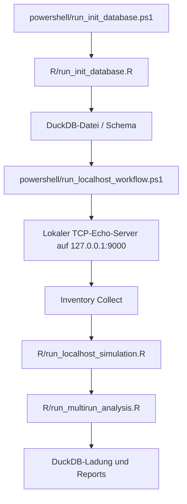

# Localhost Simulation

## Ziel

Die komplette Kette soll lokal gegen `127.0.0.1` durchgespielt werden:

- Inventur sammeln
- Steckbrief erzeugen
- Ping-Test
- TCP-Test auf Port 9000
- zusammenfassende Auswertung

## Warum das sinnvoll ist

Damit kannst du den Ablauf testen, ohne schon echte Geraete anzugreifen.
Der spaetere Vor-Ort-Ablauf ist im [Betriebsmanual](06_betriebsmanual_workflow.md)
beschrieben.

## Ablaufdiagramm

## Aufbau

1. `R/run_init_database.R`
2. lokaler TCP-Echo-Server auf `127.0.0.1:9000`
3. `inventory_collect.ps1`
4. `R/run_localhost_simulation.R`
5. `R/run_multirun_analysis.R`
6. DuckDB-Ladung und Report-Erzeugung

## Dateien

- `configs/targets.localhost.csv`
- `configs/run.localhost.csv`
- `powershell/start_local_tcp_echo_server.ps1`
- `powershell/run_localhost_workflow.ps1`
- `R/run_localhost_simulation.R`

