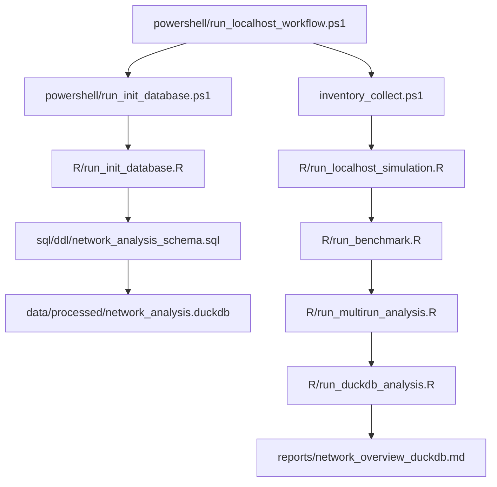

# Betriebsmanual Workflow

## Zweck

Dieses Manual beschreibt den lokalen Ablauf fuer einen Laptop an einer Anlage
oder an drei vernetzten Geraeten. Ziel ist:

- den Ist-Zustand der Kommunikation zu erfassen
- einen konfigurierbaren TCP-Port gegen die Geraete zu messen, Standard ist 9000, wobei jeder Zielhost einen eigenen Port haben kann
- einen Vergleich zwischen direkter Verbindung und Switch zu erzeugen
- die Ergebnisse als Markdown und optional in DuckDB abzulegen

Fuer die schnelle Abarbeitung vor Ort nutze zusaetzlich die
[Vor-Ort-Checkliste](07_vor_ort_checkliste_scan_auswerte_workflow.md).

## Kann ich den Laptop an die Anlage haengen?

Ja, das ist der vorgesehene Arbeitsmodus, wenn du es kontrolliert aufbaust.

Wichtig ist dabei:

- nur einen aktiven Netzwerkpfad verwenden
- Wi-Fi, VPN und andere nicht benoetigte Adapter vor dem Test deaktivieren
- keine Bruecke zum Firmennetz offen lassen, wenn du ein isoliertes Testnetz willst
- vor dem Test mit dem Betreiber bzw. Netzwerker klaeren, dass der Test erlaubt ist
- bei produktionsnahen Geraeten zuerst mit einer kurzen, vorsichtigen Laufzeit starten

Wenn du den Test gegen die reale Anlage machst, wuerde ich ihn zuerst ohne Nmap
und ohne Suricata starten und nur die Inventur plus TCP-Port-Benchmark auf mehreren Ports pro Zielhost laufen
lassen. Die passiven Werkzeuge kannst du danach dazunehmen.
Suricata nutzt in diesem Projekt den `--pcap`-Modus auf einem echten Adapter;
fuer sichtbare Logs hilft eine kleine Testregel und ein Interface, das den
Zielverkehr wirklich sieht.

## Ablaufdiagramm



Der lokale Trockenlauf ruft also zuerst die Datenbank-Initialisierung auf und
laedt danach die Mess- und Inventurdaten in dieselbe lokale DuckDB-Datei.
Die eigentliche Datenueberfuehrung in DuckDB passiert dabei ueber
`R/run_duckdb_analysis.R`; `R/run_duckdb_overview_report.R` erzeugt aus der
bereits gefuellten DuckDB nur noch den einfachen Uebersichtsreport.
Fuer einen kompakten reinen Trockenlauf sieh auch
[docs/04_localhost_simulation.md](04_localhost_simulation.md).

## Vorbereitung

### 1. Projektpfad

Arbeite aus dem Projektordner:

`C:\Pfad\zum\ot-netzwerk-monitoring`

### 2. Tool-Pfade

Die PowerShell-Wrapper suchen externe Programme in dieser Reihenfolge:

1. expliziter Script-Parameter, zum Beispiel `-RScriptPath`
2. lokale Tool-Konfiguration `configs/tools.private.csv` oder `configs/tools.csv`
3. `PATH` ueber `Get-Command`
4. bekannte Windows-Installationspfade

Als Vorlage dient `configs/tools.example.csv`. Reale lokale Pfade gehoeren in
`configs/tools.csv` oder `configs/tools.private.csv`; beide Dateien bleiben
lokal und werden nicht versioniert.

### 3. Inventur

Es gibt keine Pflichtkonfiguration fuer die Inventur.
Der Wrapper schreibt automatisch:

- `ipconfig /all`
- `netsh interface show interface`
- optional einen vorsichtigen `/24`-Ping-Sweep zur Aktualisierung des ARP-Caches
- `arp -a`
- `netstat -ano`
- `route print`

Die ARP-Liste zeigt MAC-Adressen nur fuer Teilnehmer im gleichen Layer-2-Netz.
Wenn ein Ziel ueber ein Gateway geroutet wird, ist normalerweise die
Gateway-MAC sichtbar.

### 4. Benchmark-Konfiguration

Die relevanten Dateien sind:

- `configs/targets.csv`
- `configs/targets.private.csv` fuer lokale reale Zieladressen, falls vorhanden
- `configs/run.localhost.csv` fuer den Trockenlauf
- `configs/run.direct.example.csv`
- `configs/run.switch.example.csv`

Fuer echte Tests kannst du die Beispieldateien nach
`configs/run.direct.csv` und `configs/run.switch.csv`
kopieren oder direkt die Beispiel-Dateien uebergeben.

`session_tag` traegst du in der jeweiligen Run-Config ein:

- `configs/run.localhost.csv` fuer den Trockenlauf, zum Beispiel `localhost`
- `configs/run.direct.csv` oder `configs/run.direct.example.csv`, zum Beispiel `direct`
- `configs/run.switch.csv` oder `configs/run.switch.example.csv`, zum Beispiel `switch`

Die vollstaendige Beschreibung aller CSV-Spalten steht in
[docs/08_konfigurationsreferenz.md](08_konfigurationsreferenz.md).
Fuer einen schnellen Vor-Ort-Ueberblick nutze
[docs/09_konfigurations_spickzettel.md](09_konfigurations_spickzettel.md).

### 5. Nmap-Konfiguration

Fuer Nmap kannst du die Ziele in
`configs/scan_targets.example.csv`
anpassen und spaeter als `configs/scan_targets.csv`
verwenden.
Eine fachliche Einordnung der wichtigsten Nmap-Optionen fuer OT-Netze steht in
[docs/10_nmap_optionen_ot.md](10_nmap_optionen_ot.md).

### 6. Webapp-Timing, falls eine Webanwendung mitlaufen soll

Wenn du zusaetzlich eine Webanwendung ueber laengere Zeit beobachten willst,
nutze das leichte R-Skript fuer periodische Zeitmessungen.

Die relevanten Dateien sind:

- `configs/webapp_targets.example.csv`
- `configs/webapp_targets.private.csv`
- `configs/run.webapp.example.csv`
- `configs/run.webapp.private.csv`
- `powershell/run_webapp_timing.ps1`
- `R/run_webapp_timing.R`

Empfehlung fuer den Start:

- `method = HEAD`
- `interval_sec = 60`
- `timeout_sec = 5`
- nur einen Health- oder Status-Endpunkt messen

Die fachliche Einordnung steht in
[docs/13_webapp_timing.md](13_webapp_timing.md).

## Empfohlene Reihenfolge

### Phase A: Trockenlauf

1. `powershell/run_localhost_workflow.ps1`
2. `R/run_duckdb_overview_report.R`
3. `R/run_benchmark_comparison.R`

Damit pruefst du, ob der komplette Werkzeugpfad lokal funktioniert. Der
Workflow-Wrapper ruft dabei zuerst `powershell/run_init_database.ps1` auf, das
seinerseits `R/run_init_database.R` startet.

### Phase B: Vor-Ort-Inventur

1. Laptop an das Testnetz oder an die Anlage anschliessen
2. nicht benoetigte Netzwerkadapter deaktivieren
3. optional ARP-Cache fuer das freigegebene lokale `/24` aktualisieren
4. `powershell/inventory_collect.ps1`
   oder `powershell/inventory_collect.ps1 -RefreshArpCidr 192.0.2.0/24`
   mit deinem lokalen, nicht versionierten Testnetz
5. `powershell/run_inventory_steckbrief.ps1`

Ergebnis:

- Rohdaten in `data/raw/inventory/<timestamp>/`
- Markdown-Steckbrief in `reports/`

### Phase C: Direktlauf ohne Switch

1. Geraete direkt nacheinander mit dem Laptop verbinden
2. `configs/run.direct.csv` oder `configs/run.direct.example.csv` verwenden
3. `powershell/run_benchmark.ps1`

Ergebnis:

- Ping- und TCP-Rohdaten in `data/raw/direct/<timestamp>_*.csv`
- spaeter auswertbar in R und DuckDB

### Phase D: Lauf mit Switch

1. Switch zwischenschalten
2. dieselben Zieladressen und bei Bedarf pro Zielhost unterschiedliche TCP-Ports verwenden
3. `configs/run.switch.csv` oder `configs/run.switch.example.csv` verwenden
4. erneut `powershell/run_benchmark.ps1`

Ergebnis:

- Ping- und TCP-Rohdaten in `data/raw/switch/<timestamp>_*.csv`

### Phase E: Vergleich

1. `powershell/run_benchmark_comparison.ps1`
2. optional `R/run_multirun_analysis.R`
3. optional `R/run_duckdb_analysis.R`
4. optional `R/run_duckdb_overview_report.R`

Ergebnis:

- `reports/network_direct_vs_switch.md`
- `reports/network_overview.md`
- `reports/network_overview_duckdb.md`
- `reports/duckdb_analysis_overview.md`

## Was du in den Dateien einstellen musst

### `configs/targets.csv`

Hier liegt die generische Zielvorlage fuer Ping- und TCP-Tests:

- `label`
- `host`
- `port`
- optional `request`

### `configs/targets.private.csv`

Diese Datei wird lokal bevorzugt verwendet, wenn sie existiert. Sie gehoert
nicht ins Repository und ist fuer reale Zieladressen gedacht.

- gleiche Spalten wie `targets.csv`
- fuer deinen Testfall die drei realen Geraete
- bleibt lokal und wird ueber `.gitignore` ausgeschlossen

### `configs/targets.production.example.csv`

Diese Datei ist die generische Vorlage fuer reale Zielgeraete, wenn du eine
saubere Startbasis fuer eine Anlage anlegen willst.

- dieselben Spalten wie `targets.csv`
- nur Platzhalter-Adressen aus dem Dokumentationsnetz
- gedacht zum Kopieren nach `configs/targets.csv` oder als Referenz fuer neue Projekte

### `configs/run.direct.csv` oder `configs/run.switch.csv`

Hier stellst du die Messlaenge ein:

- `ping_count`
- `tcp_count`
- `ping_interval_sec`
- `tcp_interval_sec`
- `tcp_timeout_sec`
- `tcp_port`
- `session_tag`
- `output_dir`

Empfehlung fuer den Start:

- `ping_count = 20`
- `tcp_count = 20`
- `tcp_port = 9000` als Standardwert, aber jeder freigegebene Port pro Zielhost ist moeglich
- `session_tag = direct`, `switch` oder `localhost`

### `configs/scan_targets.csv`

Hier bestimmst du, ob und welche Hosts mit Nmap gescannt werden.

## Startskripte

### Inventur

```powershell
powershell\inventory_collect.ps1
powershell\inventory_collect.ps1 -RefreshArpCidr 192.0.2.0/24
powershell\refresh_arp_cache.ps1 -NetworkCidr 192.0.2.0/24
powershell\run_inventory_steckbrief.ps1
```

### Benchmark

```powershell
powershell\run_benchmark.ps1
powershell\run_benchmark_comparison.ps1
```

### Nmap

```powershell
powershell\run_nmap_scan.ps1
```

### Mitschnitt

```powershell
powershell\list_capture_interfaces.ps1
powershell\start_wireshark_capture.ps1
powershell\start_suricata_capture.ps1
```

### DuckDB

```powershell
powershell\run_init_database.ps1
powershell\run_r_script.ps1 -ScriptPath R\run_duckdb_analysis.R
powershell\run_r_script.ps1 -ScriptPath R\run_duckdb_query.R sql\inventory_overview.sql
powershell\run_r_script.ps1 -ScriptPath R\run_duckdb_overview_report.R
```

`R/run_init_database.R` legt das Schema an, inklusive der DuckDB-Views fuer die
wichtigsten Basisabfragen:

- `inventory_overview`
- `benchmark_overview`
- `benchmark_rows_ping`
- `benchmark_rows_tcp`

`R/run_duckdb_analysis.R` importiert die aktuellen Inventur- und Benchmarkdaten
in die DuckDB, `R/run_duckdb_overview_report.R` liest nur noch aus der
vorhandenen Datenbank und schreibt den Uebersichtsreport.

Bei mehreren Messpaaren kannst du den Direkt-vs-Switch-Vergleich explizit
auswaehlen:

```powershell
powershell\run_benchmark_comparison.ps1 -BaseTag direct -CompareTag switch
```

### Archivieren und Zuruecksetzen

```powershell
powershell\archive_data_backup.ps1
powershell\restore_data_backup.ps1
```

Das legt einen Zeitstempel-Ordner unter `data/backups/` an, sichert `data/raw/`,
`data/processed/` und `reports/` und leert danach den Arbeitsbestand.
`powershell\archive_data_backup.ps1 -WhatIf` zeigt die geplanten Aktionen,
ohne etwas zu veraendern. Mit `powershell\restore_data_backup.ps1` kannst du
das letzte oder ein explizites Backup wiederherstellen.

## Praktischer Ablauf vor Ort

Wenn du nur wenig Zeit hast, dann wuerde ich so vorgehen:

1. Inventur sammeln
2. Steckbrief schreiben
3. Direktlauf messen
4. Switch-Lauf messen
5. Vergleichsreport erzeugen
6. erst danach Nmap oder Mitschnitt aktivieren

## Optionaler Feinschliff

Wenn das Programm auf einem bestimmten Port besonders kritisch ist, kannst du den Test
so weiter schärfen:

- laengere Messreihe, aber niedrige Frequenz
- einen kurzen Mitschnitt mit Wireshark waehrend der TCP-Probe
- Nmap nur fuer die drei bekannten Ziele
- Suricata nur passiv und nur im Testfenster
- Suricata auf einem echten Adapter mit einer Testregel laufen lassen, wenn du
  Alerts oder `eve.json` sehen willst

## Ergebnisdateien

Typische Ausgaben sind:

- `data/raw/inventory/<timestamp>/`
- `data/raw/direct/<timestamp>_*.csv`
- `data/raw/switch/<timestamp>_*.csv`
- `reports/steckbrief_*.md`
- `reports/network_overview.md`
- `reports/network_direct_vs_switch.md`
- `reports/network_overview_duckdb.md`
- `reports/duckdb_analysis_overview.md`

## Kurzfazit

Ja, du kannst den Laptop an die Anlage anschliessen und den Workflow
durchlaufen lassen, wenn du ihn kontrolliert und isoliert aufbaust.
Der empfohlene Start ist:

1. Inventur
2. Steckbrief
3. Direktlauf
4. Switchlauf
5. Vergleich
