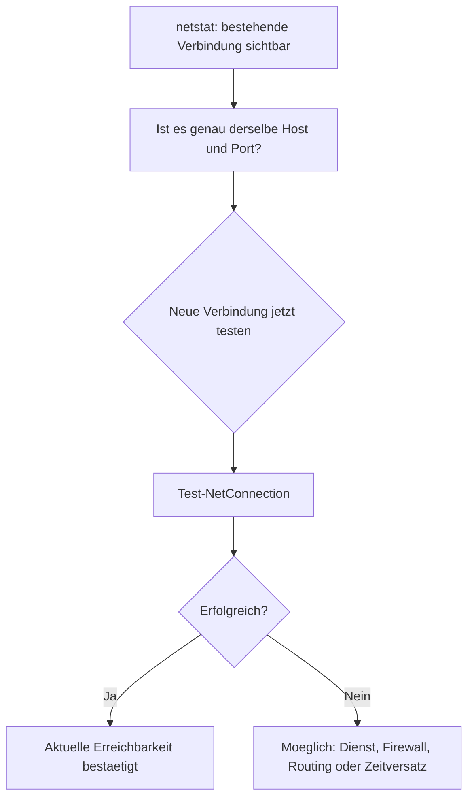

# `netstat` vs. `Test-NetConnection`

## Kurzantwort

Nein: Wenn `netstat` bei einem Eintrag `Established` oder `Hergestellt`
zeigt, heisst das **nicht automatisch**, dass `Test-NetConnection` sofort
erfolgreich sein muss.

`Established` bedeutet nur:

- zum Zeitpunkt des Snapshots gab es eine bestehende TCP-Verbindung
- die Verbindung war bereits aufgebaut
- es ist eine Momentaufnahme, kein Garant fuer die naechste Verbindung

`Test-NetConnection` prueft dagegen:

- ob **jetzt gerade** eine **neue** TCP-Verbindung aufgebaut werden kann
- ob der Zielhost und der Zielport aktuell erreichbar sind
- ob eine neue Aushandlung bis zum Ziel klappt

## Warum sich das widersprechen kann

Ein `Established`-Eintrag in `netstat` kann trotzdem auftreten, waehrend
`Test-NetConnection` fehlschlaegt, zum Beispiel wenn:

1. die bestehende Verbindung noch offen ist, der Dienst aber gerade keine
   neuen Verbindungen mehr annimmt
2. der Dienst nach der alten Verbindung abgestuerzt oder neugestartet wurde
3. Firewall, Routing oder Switch-Zustand sich seit der alten Verbindung geaendert haben
4. `netstat` eine alte oder bereits nur noch halbgueltige Sitzung zeigt
5. IPv4 und IPv6 unterschiedlich behandelt werden
6. du nicht exakt denselben Zielhost oder dieselbe Zielrichtung vergleichst

Wichtig:

- `netstat` zeigt Sockets und Verbindungszustand
- `Test-NetConnection` prueft den aktuellen Verbindungsaufbau
- beides ist verwandt, aber nicht dasselbe

## Fachliche Einordnung fuer den OT-Fall

Wenn du im OT-Umfeld eine Verbindung zu Port 9000 siehst, dann kann das
bedeuten:

- es gibt eine aktive bestehende Sitzung
- der Dienst war in diesem Moment erreichbar
- die Kommunikation laeuft zumindest auf einer Strecke

Wenn `Test-NetConnection` aber `False` liefert, dann ist das ein Hinweis auf
eine Veraenderung zwischen den Zeitpunkten oder auf einen anderen Pfad,
nicht automatisch auf einen Fehler in `netstat`.

Ein Port kann also durchaus fuer **neue** Verbindungen blockiert oder nicht
mehr erreichbar sein, obwohl eine alte Verbindung im `Established`-Zustand
noch angezeigt wird.

## Einordnung unseres R-Tests

Unser R-Test ist fachlich naeh an `Test-NetConnection`, aber etwas
ausfuehrlicher:

- er misst `connect_ms`
- er misst `total_ms`
- er speichert optional Request und Antwort
- er protokolliert die Rohdaten fuer spaetere Auswertung in DuckDB

Damit ist der R-Test fuer die Vergleichsmessung und fuer Benchmarks besser
geeignet als ein reiner einmaliger Windows-Check.

## Merksatz

`netstat` sagt: "Da war bzw. ist eine Verbindung."

`Test-NetConnection` sagt: "Kann ich jetzt neu verbinden?"

Unser R-Test sagt: "Kann ich verbinden, wie lange dauert es und was kommt
zurueck?"

## Ablaufhinweis

## Praktische Daumenregel

- Wenn `netstat` `Established` zeigt, ist das ein guter Hinweis auf eine
  bestehende Kommunikation
- Wenn `Test-NetConnection` trotzdem `False` meldet, pruefe zuerst den
  Zeitpunkt, den genauen Port und die Richtung der Verbindung
- fuer reproduzierbare OT-Messungen bleibt unser R-Workflow die bessere
  Dokumentationsbasis

