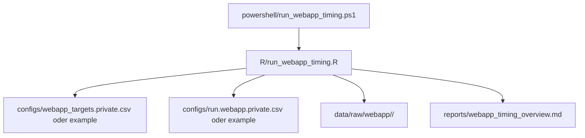

# Webapp Timing

## Ziel

Wenn eine Webanwendung immer wieder in Timeouts laeuft, wollen wir nicht mit
einem schweren Security-Werkzeug starten, sondern mit einer kleinen,
parametrisierbaren Zeitmessung.

Dieses Teilprojekt misst deshalb in festen Abstaenden die Antwortzeit einer
Webanwendung und schreibt die Rohdaten fuer spaetere Auswertung weg.

## Warum R und nicht ZAP?

ZAP ist gut fuer:

- Webanalyse
- Crawling
- Proxy-Tests
- Security-Pruefungen

Fuer reine Zeitmessung ist ZAP aber meist zu schwergewichtig.

Das R-Skript ist hier besser, weil es:

- nur einen einzelnen Request pro Intervall sendet
- keine Crawl- oder Proxy-Logik mitbringt
- sich gut auf 60 Sekunden oder andere Intervalle einstellen laesst
- die Rohdaten direkt als CSV speichert

## Was gemessen wird

Die aktuelle Version arbeitet bewusst leichtgewichtig und misst:

- Verbindungsaufbau
- Zeit bis zur ersten Antwortzeile
- Gesamtzeit bis zum Abschluss des HTTP-Headers
- HTTP-Statuscode
- Erfolg oder Fehler

Die Messung ist als Erstversion fuer `http://`-Ziele ausgelegt und sendet
standardmaessig `HEAD`, damit die Anwendung moeglichst wenig belastet wird.
Die Rohdaten speichern Zeitstempel als portable ISO-Textform in `UTC`, damit
der Lauf auch auf anderen Rechnern ohne Zeitzonen-Artefakte auswertbar bleibt.

## Konfiguration

Die wichtigsten Dateien sind:

- `configs/webapp_targets.example.csv`
- `configs/webapp_targets.private.csv`
- `configs/run.webapp.example.csv`
- `configs/run.webapp.private.csv`

Die `*.example.csv`-Dateien bleiben im Repo.
Die `*.private.csv`-Dateien sind fuer reale Werte gedacht und bleiben lokal.

## Typische Felder

### Ziel-CSV

- `label`: Anzeigename fuer den Report
- `url`: komplette Ziel-URL, zum Beispiel `http://.../health`
- `method`: `HEAD` oder `GET`
- `interval_sec`: optionaler Ziel-Override fuer das Intervall
- `timeout_sec`: optionaler Ziel-Override fuer den Timeout

### Run-CSV

- `sample_count`: Anzahl der Messungen pro Ziel
- `interval_sec`: Sekunden zwischen den Samples
- `timeout_sec`: Socket-Timeout in Sekunden
- `method`: Standard-Methode, wenn das Ziel nichts ueberschreibt
- `timezone`: optionale Zeitzone fuer Lauf und Rohdaten, empfohlen `UTC`
- `session_tag`: Laufbezeichnung
- `output_dir`: Basisordner fuer die Rohdaten

## Ablauf



## Was dabei auf Platte landet

- Roh-CSV pro Ziel und ein kombinierter CSV-Export
- ein Markdown-Report mit Zieluebersicht und Kennzahlen
- spaeter optional DuckDB-Auswertung, wenn wir das Schema erweitern

## So startest du

```powershell
powershell\run_webapp_timing.ps1
```

Wenn du andere Dateien verwenden willst, kannst du sie explizit angeben:

```powershell
powershell\run_webapp_timing.ps1 -TargetsConfig configs\webapp_targets.private.csv -RunConfig configs\run.webapp.private.csv
```

## Empfehlung fuer den ersten Praxistest

1. einen gueltigen Health- oder Status-Endpunkt waehlen
2. mit `HEAD` beginnen
3. Intervall zunaechst auf 60 Sekunden setzen
4. Timeout eher kurz halten, zum Beispiel 5 Sekunden
5. erst danach bei Bedarf auf `GET` oder kuerzere Intervalle gehen

## Wenn `Bad Request` auftaucht

- pruefe zuerst die genaue URL und den Pfad
- pruefe dann, ob der Server `HEAD` akzeptiert
- wenn noetig, schalte pro Ziel auf `GET` um
- ein `400 Bad Request` ist in der Regel eine echte HTTP-Antwort des Zielsystems und kein reiner Messfehler

## Einordnung

- fuer reine Latenz- und Timeoutmessung: R-Skript
- fuer Web-Security oder Interception: ZAP
- fuer tiefe Paket-Analyse: Wireshark/tshark
